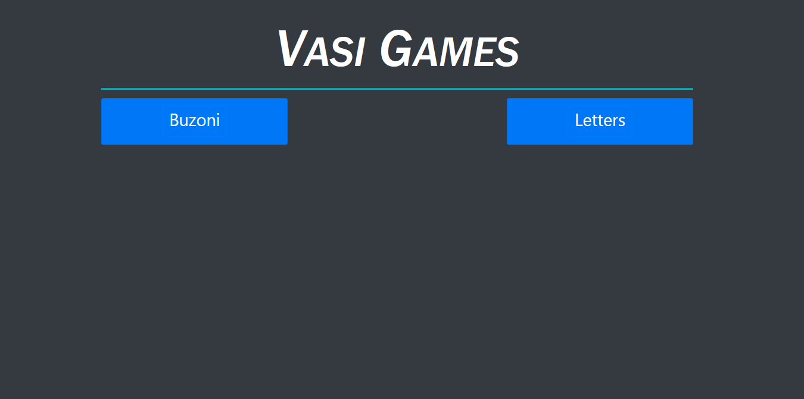
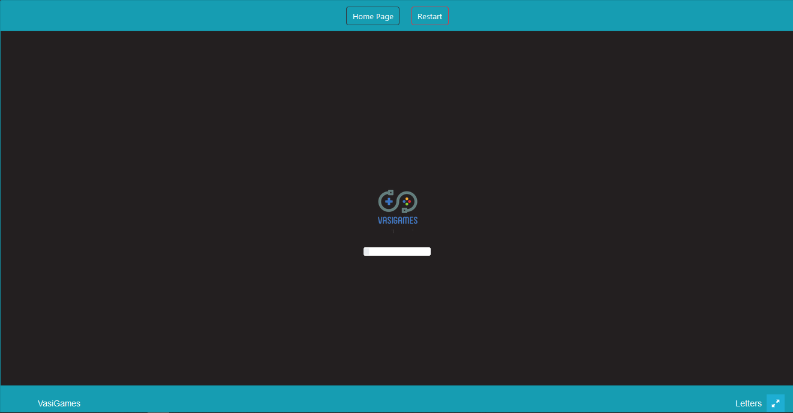
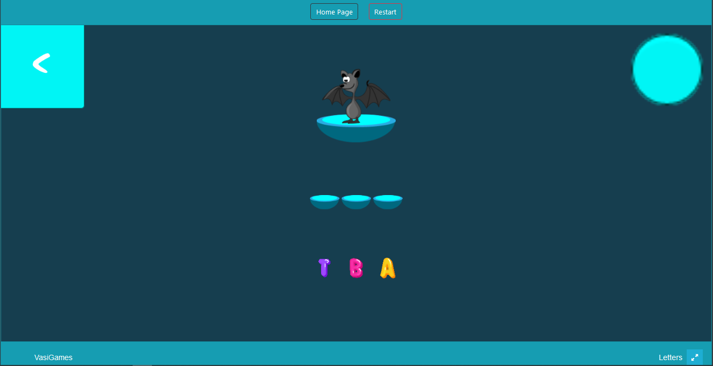
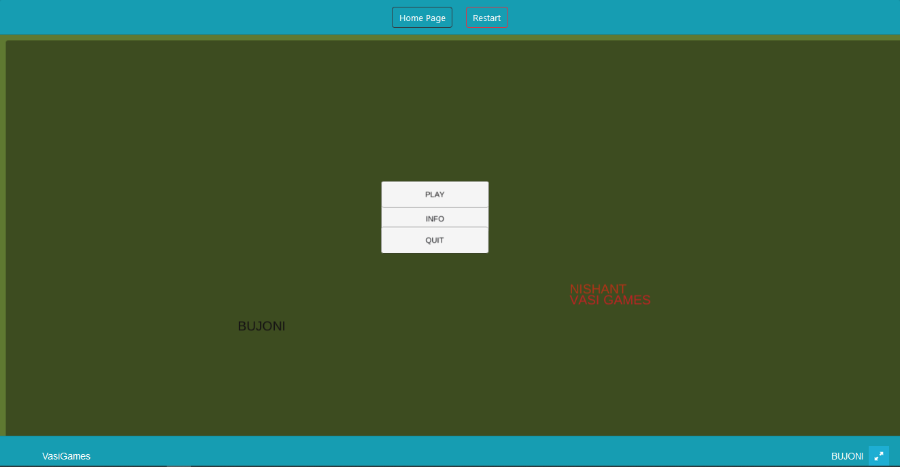
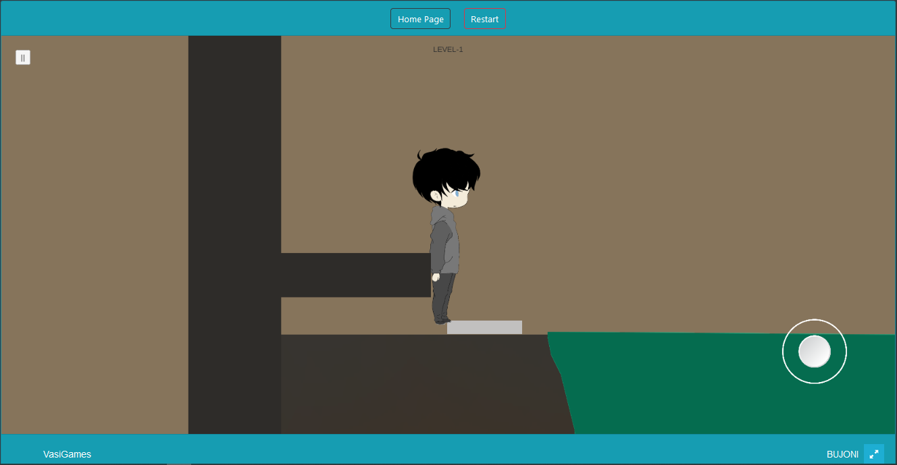

# UnityBased-Webgl-Game
its basically unitybased webgl game platform where user can play game on browser because it is web version of unity . Here only two basic level games available.
1. Buzoni := it is very logical  and puzzle type game .Player is trying to find gems that is hidden in a proper pattern
if player follow a right pattern then he is able to find gems otherwise not 
2. Letters := it is education base kids game , in this game a object appear on the screen and below the object some random letter appear,
player's work here arrange the appear letter in right way that become a meaning of appear object.

#Game Developed by Vasi Team
1. Pushkar Chaudhary :- Game Design and Developer
2. Nishant Sinha :- Game Design and Developer
3. Rajesh :- Frontend and Backend Developer
4. Shubham Sindhu :- Tester and Manager 

#Home Page
index page where caan choose a game which one user want to play

     

#Game load view

before game start the load page open

    

#Letters Game
it is a child game game where children can learn from game.
a object can appear on the game screen with some unarrange letters ,child task is arrange that letters in right sequence that word is the meaning of that object

    

#Buzoni Game
it is puzzle base game , your task is to solve puzzle and find hidden gem

    

    

### Hi there, I'm <a href="https://www.sololearn.com/profile/10902790#_=_" target="_blank">Rajesh Rathore</a> 

